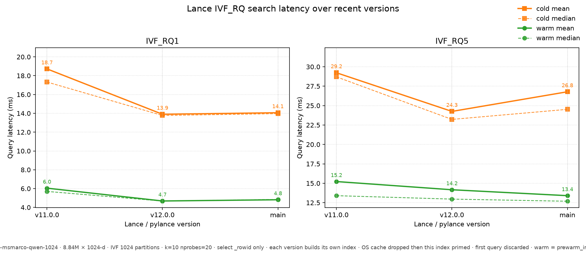

# VIBE MSMARCO IVF_RQ Search Latency

Compare Lance IVF_RQ vector-search latency across recent releases on
[`lance-format/vibe-msmarco-qwen-1024`](https://huggingface.co/datasets/lance-format/vibe-msmarco-qwen-1024).

The chart covers **IVF_RQ1** and **IVF_RQ5** in two cache states:

- **warm** — `prewarm_index`, then time on that handle
- **cold** — fresh dataset per query; metadata opened untimed; partitions not
  prewarmed

Each (version, index) cell starts with `sync` + OS page-cache drop, then a
sequential read of **that** index's files so every cell is lance-cold against
the same OS-warm baseline. The first query of each mode is discarded.

Queries project only `_rowid` so the timed path does not read payload columns.

## Dataset

| Field | Value |
| --- | --- |
| Corpus | 8,840,823 unit-normalized 1024-d float32 vectors |
| Queries | 1,000 (default timed subset: first 100) |
| Metric | cosine |
| Index | `IVF_RQ` with `num_bits=1` and `num_bits=5` |
| Partitions | 1024 |
| Search | `k=10`, `nprobes=20` |

## Run

```sh
# 1. Download the Hugging Face snapshot (~36 GB)
python bench.py download --data-dir /tmp/lance-vibe-msmarco

# 2. Build indexes and time one pylance interpreter
python bench.py run \
    --data-dir /tmp/lance-vibe-msmarco \
    --label v12.0.0 \
    --out results/v12.0.0.json

# 3. Plot every results/*.json
python plot.py --results-dir results --out results/ivf_rq_latency.png
```

`run_versions.py` installs isolated interpreters for pylance 9.0.1, 10.0.0,
11.0.0, 12.0.0, plus a local checkout of this repo, then runs the full matrix.
`--only v9.0.1,v10.0.0` measures just those labels and merges them into the
existing result manifest.

Each version builds its own `IVF_RQ1` and `IVF_RQ5` indexes in a private
work corpus (fragment files are hardlinked from the snapshot; manifests are
copied). Do not share one on-disk index across runtimes when comparing
version performance.

## Measured results (2026-09-19)

Machine: 4 vCPU, 15 GiB RAM. 100 **timed** queries after discarding the first,
`k=10`, `nprobes=20`, `_rowid` only. Each version writes its own indexes.
OS page cache is dropped at the start of every cell.

| Index | Version | Cold mean (ms) | Cold median (ms) | Warm mean (ms) | Warm QPS |
| --- | --- | ---: | ---: | ---: | ---: |
| IVF_RQ1 | v11.0.0 | 18.7 | 17.3 | 6.05 | 165 |
| IVF_RQ1 | v12.0.0 | 13.9 | 13.8 | 4.68 | 214 |
| IVF_RQ1 | c8f182179 (main) | 14.1 | 14.0 | 4.81 | 208 |
| IVF_RQ5 | v11.0.0 | 29.2 | 28.7 | 15.2 | 66 |
| IVF_RQ5 | v12.0.0 | 24.3 | 23.2 | 14.2 | 71 |
| IVF_RQ5 | c8f182179 (main) | 26.8 | 24.5 | 13.4 | 75 |

Under this protocol, main IVF_RQ1 matches v12 (cold ~14 ms, warm ~4.8 ms).
v11 is slower on both bit widths. IVF_RQ5 cold is v12 24.3 / main 26.8 /
v11 29.2; warm is close and main is slightly fastest.

Index build wall time on this box: v11 RQ1/RQ5 420s/466s, v12 227s/457s,
main 223s/461s.


