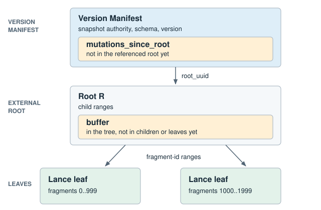

# Fragment Metadata Tree

!!! warning "Experimental"

    This layout is unstable. Readers and writers may change it without
    keeping compatibility with earlier unstable revisions. Flat manifests
    remain the default.

**This page specifies a proposed on-disk format for storing fragment state.
Support for creating or reading tree tables is not yet available in released
Lance versions.**

!!! note "Tree tables require feature flag 2048, `FLAG_FRAGMENT_TREE`"

    A reader or writer that does not understand this layout must refuse the
    dataset. The flat `fragments` list is empty on a tree table, so a reader
    that ignored the flag would see an empty table.

In the flat format, each Version Manifest carries the complete fragment list.
Committing a change and opening a dataset both process that whole list, even
when the change touches only a few fragments.

The fragment metadata tree (fragment tree) stores those records in immutable
Lance leaves keyed by fragment ID. Validated changes may remain above the leaves as
mutations until enough work accumulates to rewrite them.

The Version Manifest defines table-version state. Committing it makes that
version visible.



*A shallow tree is shown. Larger trees may insert interior routing nodes between
the root and leaves.*

### At a glance

| | |
|---|---|
| Read | Read the leaf record, if any, then apply newer mutations for that fragment. |
| Write | Native Lance validates the change. The tree stores the resulting mutation. |
| Publish | Write immutable tree objects first, then commit the Version Manifest. |

Protobuf messages are in `protos/fragment_metadata.proto`.
`Manifest.fragment_tree` is declared in `protos/table.proto`. Operation
semantics, conflict rules, and native validation stay with
[transactions](transaction.md). A storage action is the result of a successful
native transaction.

Readers must treat a violation of any requirement on this page as a corrupt
snapshot.

## Snapshot

A tree table must set `Manifest.fragment_tree`, leave `Manifest.fragments`
empty, and set flag 2048 in both `reader_feature_flags` and
`writer_feature_flags`. These fields must agree. When `FLAG_FRAGMENT_TREE`
is set, `FragmentTreeMetadata.layout` must select exactly one recognized layout.

Each version stores fragment records either in the tree or in
`Manifest.fragments`, never both. A writer may convert a flat table by
publishing a new tree-backed version. Whether and when to convert is
writer policy.

A `FragmentTree` must contain exactly one of an inline root or a
`root_uuid`.

An inline root carries the complete `FragmentTreeRoot` in the Version
Manifest. `mutations_since_root` must be empty.

An external root named by `root_uuid` belongs to the current dataset.
`root_uuid` must contain exactly 16 bytes, in the order of the UUID's hexadecimal
digits. Its path is `_bt/root/{uuid}.root`, with lowercase hexadecimal digits and
hyphens after digits 8, 12, 16, and 20. Readers must reject any other byte length.
`mutations_since_root` contains every mutation in this version that is not
represented by that root. Readers must not follow a mutation chain.

```
Version Manifest N
├─ root_uuid ──────────► Root R
└─ mutations_since_root

fragment state N = Root R + mutations_since_root
```

Opening a version requires its Version Manifest and at most one external root.
Version history is not consulted.

`buffer` on a root or interior holds mutations already in the tree that have
not been pushed to that node's children.

## Tree objects

Tree objects are immutable and stored under `_bt/` relative to a dataset root.
Tree object paths must begin with `_bt/`. Readers must reject absolute paths
and paths outside `_bt/`.

```
{dataset_root}/
    _bt/
        root/{uuid}.root     FragmentTreeRoot protobuf
        node/{uuid}.node     FragmentTreeNode protobuf
        leaf/{uuid}.lance    Lance file of complete fragment records
```

A `.root` file is a raw `FragmentTreeRoot` protobuf. A `.node` file is a
raw `FragmentTreeNode` protobuf. Neither has an extra header or footer.

`FragmentTreeRoot` holds its children, buffer, and `next_action_sequence`.

`FragmentTreeNode` holds the child list and a mutation buffer for that
subtree.

Child `path` values must be non-empty. Resolved child locations within a child
list must be unique. Equal paths in different datasets name different objects;
different `base_id` values resolving to the same object do not make it unique.

A leaf is a Lance file of complete fragment records for one fragment-ID range.

## Object references

The Version Manifest root belongs to the current dataset. It is either an
inline `FragmentTreeRoot` or a `root_uuid` in the current dataset.

A `FragmentTreeChild` contains a `path` relative to its resolved dataset
and an optional `base_id`.

When `base_id` is set, it must identify a `BasePath` in the Version Manifest
with `is_dataset_root` set to true. When `base_id` is absent, the reference
inherits the resolved dataset of the containing tree object.
Look up entries by `BasePath.id`, not their position in `base_paths`. Zero is a
valid ID, distinct from an absent `base_id`. IDs must be unique within the
manifest, and readers must reject an unknown ID.

A child object resolves to `{resolved_dataset}/{path}`. Tree object paths must
begin with `_bt/` and must not be resolved under `data/`.

A reference with `base_id` set may name an immutable tree object in another
dataset. Descendant references with no `base_id` inherit that object's resolved
dataset.

New tree objects must belong to the current dataset. Tree objects owned by
another dataset must not be modified.

A shallow clone's root must belong to the clone dataset. Unchanged source
subtrees may be referenced through `base_id`. The clone's `base_paths` must
contain a `BasePath` for the source dataset root and preserve every `BasePath`
entry referenced by a shared tree object at the same id. New base paths must
use previously unused ids.
If an ID already names a different base, the writer must copy the affected
objects and remap their references, or reject the operation. It must not change
the meaning of an ID used by a shared immutable object.

When a tree object is copied into another dataset, references that inherited
the source dataset must be rewritten with a `base_id` naming that dataset.
Existing explicit `base_id` values must continue to resolve to the same
`BasePath` entries.

An `ExternalFile` embedded in `DataFragment` has no `base_id`. Its path is
relative to the resolved dataset of the tree object or Version Manifest that
contains the fragment state.

When fragment state is written to a different dataset, each referenced
`ExternalFile` must be copied to that dataset and its path rewritten before
publication. The write must fail if any such reference cannot be preserved.

## Leaf format

A leaf is a Lance file with one row per fragment and the following schema.
Any Lance file version may be used.

```python
import pyarrow as pa

mapping = pa.dictionary(pa.int32(), pa.binary())
data_file = pa.struct([
    pa.field("path", pa.utf8(), nullable=False),
    pa.field("field_ids", mapping, nullable=False),
    pa.field("column_indices", mapping, nullable=False),
    pa.field("major_version", pa.uint32(), nullable=False),
    pa.field("minor_version", pa.uint32(), nullable=False),
    pa.field("file_size_bytes", pa.uint64(), nullable=False),
    pa.field("base_id", pa.uint32(), nullable=True),
])
overlay = pa.struct([
    pa.field("data_file", data_file, nullable=False),
    pa.field("overlay_meta", pa.binary(), nullable=False),
])
leaf_schema = pa.schema([
    pa.field("id", pa.uint64(), nullable=False),
    pa.field("fragment_meta", pa.binary(), nullable=False),
    pa.field("files", pa.list_(pa.field("item", data_file, nullable=False)), nullable=False),
    pa.field("overlays", pa.list_(pa.field("item", overlay, nullable=False)), nullable=False),
])
```

The schema must match exactly, including field order, types, and nullability.
Only `base_id` may be null; dictionary values must also be non-null. Empty lists
represent no files or overlays.

Rows must be ordered by strictly increasing `id`. Valid fragment IDs fit in
`u32`. A fragment must not be split across leaves. Preserve file and overlay
list order, including duplicate file paths and the overlay precedence defined
in [Data Overlay Files](data_overlay_file.md).

`fragment_meta` contains the `DataFragment` protobuf with `id` set to 0 and
`files` and `overlays` cleared. Readers must reject a nonzero protobuf `id` or
nonempty `files` or `overlays`, then restore these fields from the row.
All other fragment fields keep their protobuf representation and semantics.

Each file struct represents a `DataFile`: `field_ids` maps to `fields`, and
`major_version` and `minor_version` map to `file_major_version` and
`file_minor_version`. Other fields use their protobuf names.

`overlay_meta` contains the `DataOverlayFile` protobuf with `data_file` absent.
Readers must reject a populated `data_file`, then restore it from the sibling
struct. Coverage and committed version retain their protobuf semantics.

Each binary dictionary value stores a mapping vector as consecutive little-endian
signed 32-bit integers, without a length prefix. Empty bytes mean an empty vector.
Readers must reject lengths not divisible by 4 and out-of-bounds dictionary keys.
Decoded vectors preserve element order and signed values, and must satisfy the
`DataFile` mapping rules for that file version.

Lance stores the dictionaries. Keys are local to their dictionary array; compare
decoded vectors, not keys, across arrays, columns, batches, or leaves.

`file_size_bytes` of 0 means unknown. A null `base_id` inherits the leaf
object's resolved dataset. A set `base_id` matches `BasePath.id` in this Version
Manifest's `base_paths`. The same inheritance rule applies to deletion files, overlays,
and other fragment-owned files. A null `base_id` in a buffered mutation
inherits the resolved dataset of the structure containing that mutation.

Counts in a leaf are known. `physical_rows` of 0 is zero rows. A deletion file
must carry `num_deleted_rows`, which must not exceed `physical_rows`.

After decoding a leaf, readers must verify the following fields against its
parent `FragmentTreeChild`:

- `num_keys` equals the number of rows
- `total_rows` and `visible_rows` equal the counts recomputed from the
  fragment records
- `height` is 0
- `num_children` is 0

`min_key` is an inherited routing bound. `object_size` is the stored byte
length of the fetched object. `materialized_through_action_sequence` is stored
on the child reference. Readers must validate those fields by the rules in
Routing and Sequence numbers, not by recomputing them from the leaf file.

## Routing

A root may have zero or more children. With no children, mutations may remain
in the root `buffer` or `FragmentTree.mutations_since_root`. Fragment
resolution must not descend to a leaf. Once children exist, they route
fragment IDs as follows.

Interior nodes must have at least two children. The root may have zero, one,
or more.

Children are ordered by `min_key`. `min_key` is the inclusive lower bound of
this child's fragment-ID range. It need not equal an ID currently stored in
the child. The next child's `min_key` is the exclusive upper bound. The
first child of the root must have `min_key` 0. An interior node's first
child must begin at the lower bound assigned by its parent. Together, the
children must partition the parent range. Routing a fragment ID selects the
rightmost child whose `min_key` is at most that fragment ID.

Ranges must not overlap. Each mutation buffered by an interior must belong to
exactly one child range. The same rule applies to a root once it has children.

`height` is the number of edges from the referenced object to its leaves.
Leaves have height 0. Every child of an interior must have height one less
than that interior, so all leaves in a subtree occur at the same depth.

A leaf must contain at least one fragment record and have `num_children` 0.
Writers must not retain an empty child.

`num_children` is the number of direct children in the referenced object. It
is 0 for leaves and at least 2 for interiors. After an interior is decoded,
readers must verify that this value equals `children.len()`.

`num_keys` is the number of fragment records in the referenced subtree,
including that object's own buffer. Mutations held by ancestors are excluded.
After a leaf is decoded, it must equal the number of rows. After an
interior is decoded, it must equal the sum of the children's `num_keys` plus
the buffer `fragment_count_delta`s.

`total_rows` is the physical-row count in that subtree, including deleted
rows. `visible_rows` is that count minus deleted rows. Both include that
object's own buffer and exclude ancestor mutations. `visible_rows` must not
exceed `total_rows`. After a leaf is decoded, both must equal the counts
recomputed from fragment records. After an interior is decoded, both must
equal the sum of the children's values plus the corresponding buffer deltas.

`object_size` is the stored byte length of the child object. It must be
nonzero. It is known before the child is fetched and must equal the fetched
object's byte length.

A child's inherited range is `min_key` inclusive to the next sibling's
`min_key` exclusive. The last child of the root uses `2^32` as that exclusive
end. The last child of an interior uses the exclusive end assigned by its
parent. `min_key` must be at most `2^32 - 1`.

Every fragment ID decoded from a leaf must lie in that leaf's inherited
range. Every mutation target decoded from a root or interior buffer must lie
in that node's inherited range. Every descendant child range must be contained
in its parent's range. Readers apply these checks as objects are decoded. The
checks do not require opening the rest of the tree.

## Mutations

`FragmentTreeMutation` wraps one `FragmentAction` with a sequence number
and three count deltas. Every mutation must contain an action. The action must
select exactly one recognized variant, and any message payload required by
that variant must be present.

`fragment_count_delta` is 1 when the action creates a record, minus 1 when it
removes one, and 0 otherwise. `total_rows_delta` and `visible_rows_delta` are
the record after the action minus the record before it. An absent record
counts as zero.

When the prior fragment is available, readers must recompute the mutation
deltas and verify that they match the stored values. Ancestor summaries are
maintained from these deltas. After materialization, readers must recompute
leaf summaries from records. Writers must not publish a materialization whose
recomputed summaries disagree with the derived version totals.

File and deletion-file actions must leave all other `DataFragment` fields
unchanged. Use `upsert_fragment` when no other action can represent the change.
This includes changes to overlay files, version sequences, and row-ID state.
It replaces the complete fragment record.

Removal actions are idempotent. Removing an absent fragment, file, or deletion
file is a no-op where specified below. Actions that modify an existing
fragment require that fragment to exist.

| Action | Precondition | Effect |
|---|---|---|
| `upsert_fragment` | None | Install the complete record, replacing anything at that id |
| `remove_fragment` | None | Remove the record at that id. An absent id is a no-op |
| `add_data_file` | Record present, else reject | Append the file to the end of the ordered file list |
| `remove_data_file` | Record present, else reject | Remove every file whose path matches, keeping survivor order. No match is a no-op |
| `add_deletion_file` | Record present, else reject | Set the deletion file, replacing any existing one |
| `clear_deletion_file` | Record present, else reject | Clear the deletion file. No deletion file is a no-op |
| `replace_data_file` | Record present and a file whose path equals `expected_path`, else reject | On the first such file set `path`, `file_size_bytes`, and `base_id`. Keep its field ids, column indices, and file version |

`Fragment.files` is an ordered list and paths may repeat. `replace_data_file`
edits a slot, not a path. Writers must not fold two replacements that chain
through a renamed path into one. Starting from files `[A, B]`, renaming B to
A and then replacing the first A with C yields `[C, A]`. Folding them into
one replacement of B with C yields `[A, C]`.

To resolve a fragment, collect every mutation for its id from
`mutations_since_root`, the root buffer, and each interior buffer on its
routing path. Sort by sequence and apply in order to the leaf record, or to
nothing if there is no leaf or the leaf has no record.

Version fragment count, physical-row count, and visible-row count are derived
from the root child summaries plus the root buffer deltas, then plus the
`mutations_since_root` deltas. They are not stored on `FragmentTree`.
Derived `visible_rows` must not exceed derived `total_rows`.

## Sequence numbers

Mutation sequences must be nonzero and unique.
Each tree has one sequence namespace. Writers must not reuse a sequence number
anywhere in the tree.

- `FragmentTreeRoot.next_action_sequence` is at least 1. Every sequence in
  the root buffer, in every interior buffer below it, and every leaf watermark
  below it must be less than this value.
- `FragmentTree.next_action_sequence` is at least the root's value.
  Every `mutations_since_root` sequence must be at or above the root's value
  and below `FragmentTree.next_action_sequence`.
- A leaf watermark of 0 means the leaf has applied nothing, so every mutation
  routed to it replays.

Readers must verify uniqueness across every mutation source decoded for the
operation. Uniqueness across unread subtrees is a writer invariant.

Mutations may be serialized in any order. Aggregate counts must not depend on
serialization order; readers may apply checked deltas in action sequence order.

`materialized_through_action_sequence` records how far a leaf has been
materialized. It is not part of the leaf contents. The same leaf may
therefore be referenced with different watermarks. It must be 0 on an
interior child.

A leaf watermark `N` means every mutation for that leaf's range with a
sequence at or below `N` has been incorporated into the leaf's records, with
no holes, and no buffer above the leaf holds a mutation for its range with a
sequence at or below `N`. Readers must reject a collected mutation whose
sequence is at or below the owning leaf's
`materialized_through_action_sequence`.

## Fragment IDs

`Manifest.max_fragment_id` is authoritative for fragment ID allocation. The
tree has no separate allocator.

`max_fragment_id` is absent only when no fragment ID has ever been allocated or
reserved in the lineage. It must not decrease. Deletion does not make fragment
IDs reusable, and restore must not lower the value.

The first allocated fragment ID is 0. Otherwise, allocation uses
`max_fragment_id + 1`. `ReserveFragments` advances the value. A value of
`2^32 - 1` exhausts the fragment-ID space.

Every fragment ID stored or targeted by the tree must be at most
`Manifest.max_fragment_id`. If `max_fragment_id` is absent, the tree must
contain no fragment records or fragment-targeting mutations.

## Validation

Readers must validate every structure they decode before using it. They must
not treat a corrupt snapshot as empty.

| Object | Additional checks |
|---|---|
| Manifest | Feature flags set, `fragments` empty, `fragment_tree` present, layout selected |
| `FragmentTree` | Exactly one root representation, sequence range valid, tree object references valid, no target above `max_fragment_id` |
| Root | Children and buffer valid, derived visible rows at most derived total rows |
| Node / leaf | Fetched byte length equals parent `object_size`. Shape and aggregate fields that can be recomputed from the object agree with the parent child reference. Routing bounds and the leaf watermark follow Routing and Sequence numbers. |

## Publication and cleanup

Writers compete for the next dataset version, even when changing different
fragments. A writer that loses the version race must check intervening
transactions and rebase compatible changes before retrying. Incompatible
changes fail under the normal transaction rules.

A retry may read the new manifest, transaction history, and affected tree
objects, then write a transaction record, tree objects, and a new manifest.
If changes fit in `mutations_since_root`, the external root can be reused without
rewriting a leaf. Validation, flushing, splitting, or eager loading can require
additional I/O.

Every tree object reachable from a Version Manifest must be durable before that
manifest is committed. The manifest commit is the visibility boundary.

A failed attempt leaves unreachable objects that are eligible for cleanup.

Whether to inline the root or publish a new external root is writer policy and
may change between versions.

Unchanged immutable subtrees may be reused. New tree objects must belong to
the current dataset. Reused references must preserve their resolved dataset.

Cleanup computes reachability from the fragment state of every
retained manifest, applying buffers and `mutations_since_root`. The reachable
set includes the external root named by `root_uuid`, if any, every `.node` and
`.lance` reachable from that root after resolving child references, and every
data file, deletion file, and related object that state names.
A file named only by a pending mutation is reachable through that resolved
state. A file named only by a mutation that a later mutation in the same
snapshot supersedes is not. Objects under this dataset's `_bt/` outside the
set follow the same age and in-progress rules as data files.

An object reachable from any retained manifest of this dataset must not be
removed. Tree object lifetime across datasets follows the same contract as
data files named through `base_paths`.
